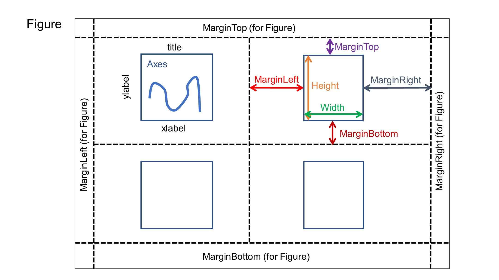
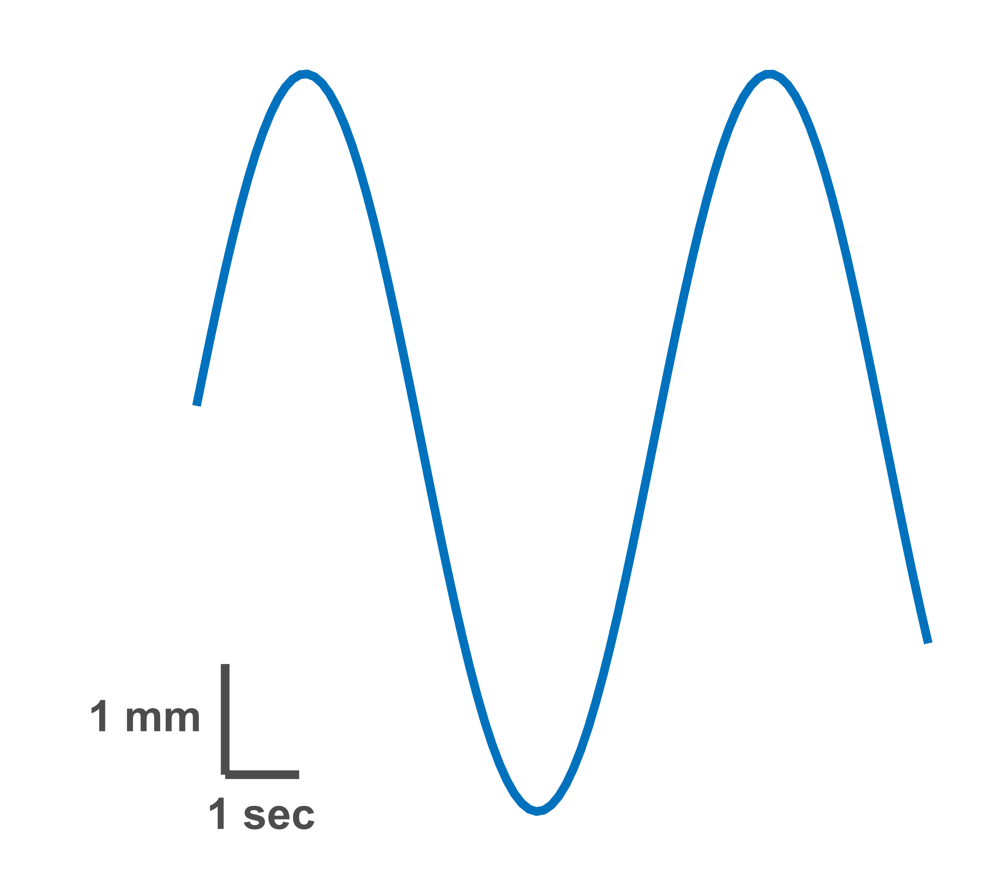
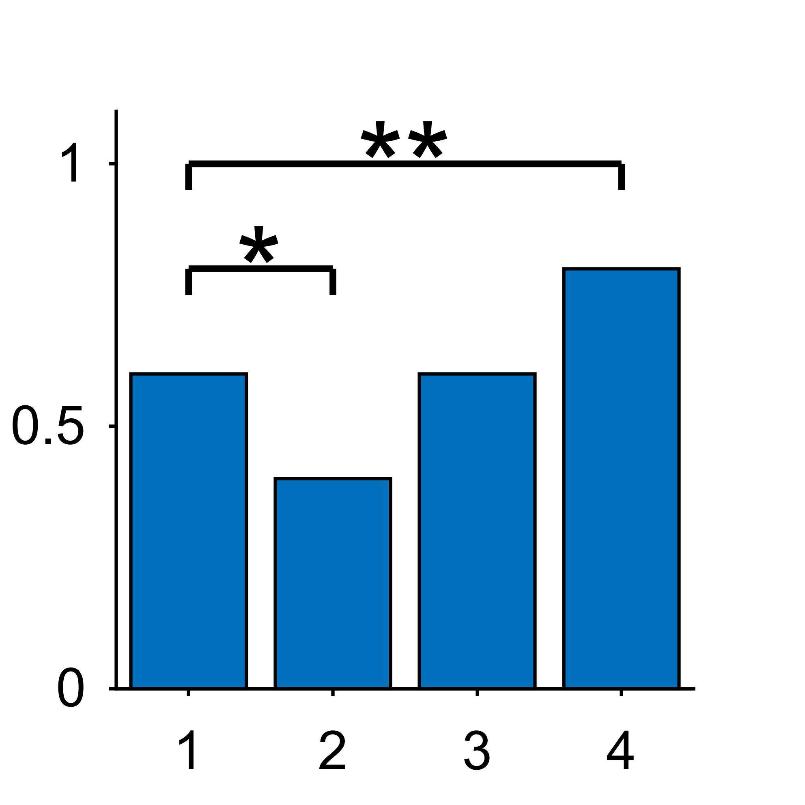
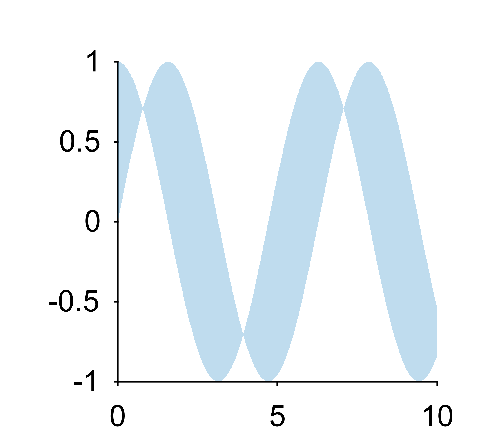
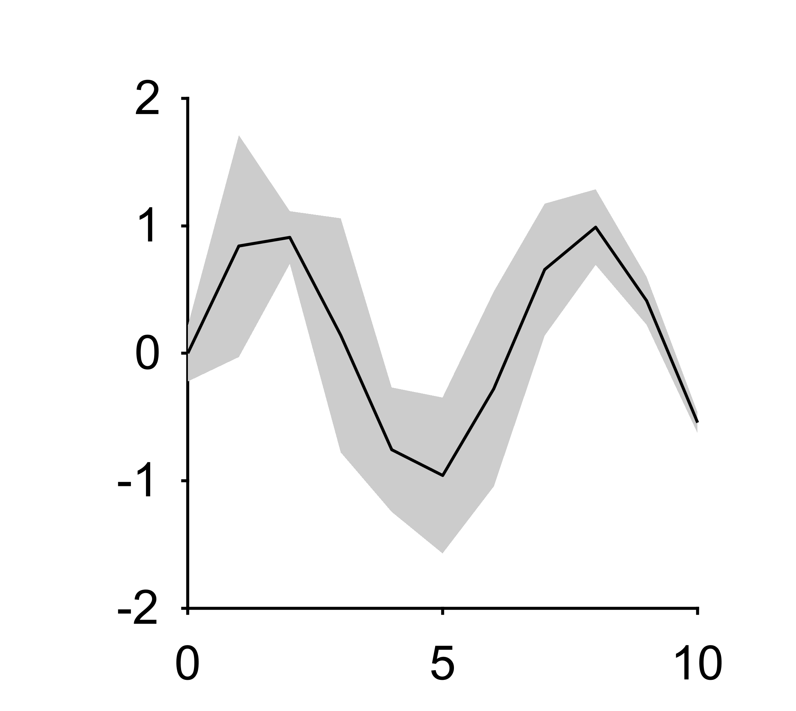
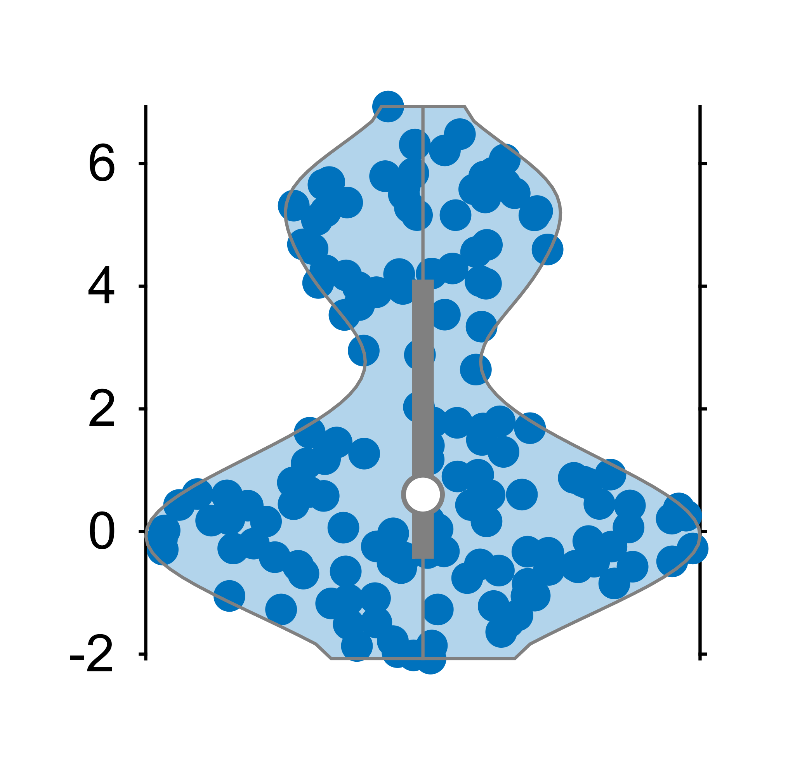
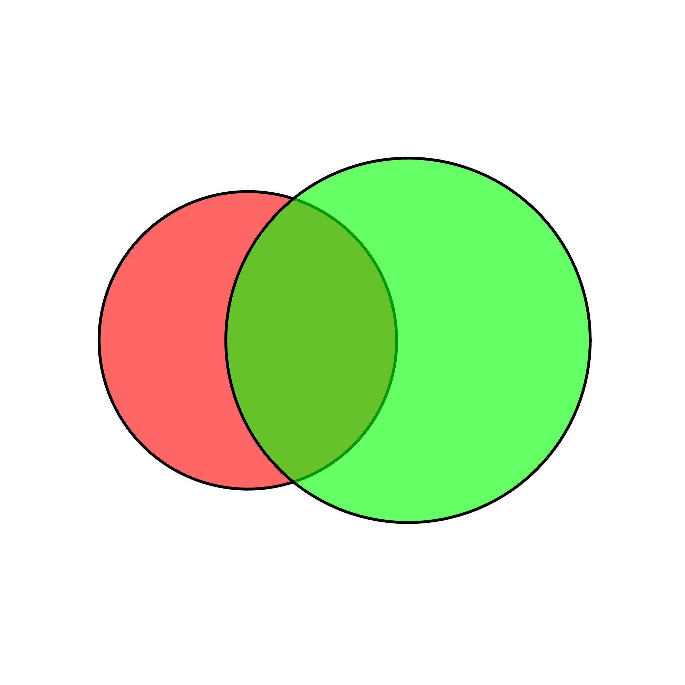

# EasyPlot documentation  
<!-- START doctoc generated TOC please keep comment here to allow auto update -->
<!-- DON'T EDIT THIS SECTION, INSTEAD RE-RUN doctoc TO UPDATE -->
- [EasyPlot documentation](#easyplot-documentation)

- [Basic usage](#basic-usage)
  - [Layouts](#layouts)
  - [Create figures / axes](#create-figures--axes)
  - [Axes methods](#axes-methods)
    - [[xyzc]Lim methods](#xyzclim-methods)
    - [[xyz]label methods](#xyzlabel-methods)
    - [[xyz]ticks methods](#xyzticks-methods)
    - [title methods](#title-methods)
    - [Move axes](#move-axes)
    - [Using `set`](#using-set)
    - [Truncate axes](#truncate-axes)
  - [Plotting methods](#plotting-methods)
    - [scalebar](#scalebar)
    - [significanceLine](#significanceline)
    - [plotShaded](#plotshaded)
    - [boundedLine](#boundedline)
    - [violinplot](#violinplot)
    - [venn](#venn)
  - [Colormaps](#colormaps)
  - [Default settings](#default-settings)
  - [Export](#export)

<!-- END doctoc generated TOC please keep comment here to allow auto update -->
## Basic usage  

### Layouts
- Every axes has 4 extra properties: `MarginLeft`, `MarginRight`, `MarginTop`, `MarginBottom`, which are similar to `HTML` web pages.
- The figure also has 4 extra properties: `MarginLeft`, `MarginRight`, `MarginTop`, `MarginBottom`.
- You can set the margins of the axes and the figure when creating them or using `EasyPlot.set` method.  
```matlab  
fig = EasyPlot.figure('marginLeft', 0.5, 'marginRight', 0.5, 'marginTop', 0.5, 'marginBottom', 0.5);
ax = EasyPlot.axes(fig, 'marginLeft', 1, 'marginRight', 0.5, 'marginTop', 0.5, 'marginBottom', 1);

EasyPlot.set(ax, 'marginLeft', 1, 'marginRight', 0.5, 'marginTop', 0.5, 'marginBottom', 1);
```

- Crop the figure to set the figure size. Always do it at the end of the code.
```matlab
EasyPlot.cropFigure(fig);
```
- After cropping, the final figure size is determined by the axes size and the margins.  


- To align the axes, use `EasyPlot.align` method.  
- The position can be `'left'`, `'right'`, `'top'`, `'bottom'`, `'horizontalCenter'` or `'verticalCenter'`.
```matlab
% Align the left edges of the axes
EasyPlot.align(ax, ax_reference, 'left');

% Align the axes to the vertical center of the reference axes
EasyPlot.align(ax, ax_reference, 'verticalCenter'); % the vertical center of the axes is aligned to the vertical center of the reference axes
```

- To place the axes next to another axes, use `EasyPlot.place` method.  
- The position can be `'left'`, `'right'`, `'top'` or `'bottom'`.
```matlab
% Place the axes to the right of the reference axes
EasyPlot.place(ax, ax_reference, 'right'); % the left edge of the axes is aligned to the right edge of the reference axes (considering the margins)
```

### Create figures / axes  
- When creating new figures / axes, please use `EasyPlot` methods instead of raw MATLAB methods.
Example:
```matlab
% Create a new figure
fig = EasyPlot.figure();
% Create a new axes
ax = EasyPlot.axes(fig);
% Create a colorbar
cbar = EasyPlot.colorbar(ax);
% Create an annotation
ann = EasyPlot.annotation(fig, 'arrow');
```
- EasyPlot provides some convenient methods to create axes.  
```matlab
% Create grid axes of 2 rows and 3 columns
ax_all = EasyPlot.createGridAxes(fig, 2, 3); % ax_all is a 2x3 cell array

% Create a new axes at the right of an existing axes
ax_right = EasyPlot.createAxesAgainstAxes(fig, ax, 'right'); % ax_right is a new axes object with the same width, height and margin as ax

% Copy an existing axes or more axes at the botom
ax_bottom = EasyPlot.copyAxes(ax, 'bottom'); % ax_bottom is a new axes object with the same width, height and margin as ax
ax_all_bottom = EasyPlot.copyAxes({ax1, ax2, ax3; ax4, ax5, ax6}, 'bottom'); % ax_all_bottom is a 2x3 cell array of new axes objects with the same width, height and margin as ax_all

% Mark the current axes with 'A', 'B', 'C'...
marks = EasyPlot.markAxes(ax_all, {'A', 'B', 'C'});
```

### Axes methods
- All MATLAB axes methods are supported, while some extra methods are created for convenience.  

#### [xyzc]Lim methods  
```matlab
% Sometimes you need to set the same limits for multiple axes
EasyPlot.setYLim({ax1, ax2}, [0, 1]);
% You may want to set the limits to the maximum and minimum values of the data
EasyPlot.setYLim({ax1, ax2}, 'Largest');
```

#### [xyz]label methods  
```matlab
% Sometimes you need to set the same labels for multiple axes
% For a column of axes, you may want to set the y label for all the axes
EasyPlot.setYLabelColumn({ax1, ax2, ax3}, 'Y label'); % ax1, ax2, ax3 are in a column
% For a row of axes, you may want to set the y label for only the leftmost axes
EasyPlot.setYLabelRow({ax1, ax2, ax3}, 'Y label'); % ax1, ax2, ax3 are in a row
```
- You may want to hide the x/y axes to avoid redundancy.
```matlab
EasyPlot.HideYAxis({ax1, ax2});
% Also you can do it when creating the axes
ax = EasyPlot.axes(fig, 'YAxisVisible', 'off');
```
- You may want to set only one label in the middle instead of setting labels for all the axes.
```matlab
EasyPlot.setGeneralXLabel({ax1, ax2, ax3}, 'X label');
% Also you can set a general title
EasyPlot.setGeneralTitle({ax1, ax2, ax3}, 'Title');
```

#### [xyz]ticks methods
```matlab
% set the y ticks for multiple axes
EasyPlot.setYTicks({ax1, ax2, ax3}, [0, 1, 2]);
% EasyPlot.yticks is the same function
EasyPlot.yticks({ax1, ax2, ax3}, [0, 1, 2]);

% set the y tick labels for multiple axes
EasyPlot.yticklabels({ax1, ax2, ax3}, [3, 4, 5]); % Both numeric array and cell array are supported

% set the y ticks and tick labels together
EasyPlot.setYTicksAndLabels({ax1, ax2, ax3}, [0, 1, 2], [3, 4, 5]);

% set x tick angles
EasyPlot.xtickangle({ax1, ax2, ax3}, 0);
```

#### title methods
```matlab
% set the title for multiple axes
EasyPlot.setTitle({ax1, ax2, ax3}, 'Title', 'FontSize', 12, 'FontWeight', 'bold');
```

#### legend methods
- It is hard in MATLAB to change the style of the legend. EasyPlot provides a convenient method to change the line and text of the legend.
```matlab
% Create a legend
h_legend = EasyPlot.legend(ax, {'A', 'B', 'C'}, 'location', 'northwest',...
        'lineLength', 0.1,... % the scale to the original line length
        'lineWidth', 6,...
        'fontSize', 7);
```  

#### Move axes
```matlab
% Move the axes to the right by 1 cm
EasyPlot.moveAxes(ax, 'dx', 1);
% move the axes downwards by 2 cm
EasyPlot.moveAxes(ax, 'dy', -2);
```

#### Using `set`
- To set the properties of multiple axes together, or the margin of the axes, use `EasyPlot.set` instead of MATLAB `set`.
```matlab
EasyPlot.set({ax1, ax2, ax3}, 'MarginLeft', 0.8, 'MarginBottom', 0.8);
```

#### Truncate axes
- The code are adapted from [here](https://zhuanlan.zhihu.com/p/553375031).
- To induce a break at the axis and generate two separate axes.
```matlab
[ax_new1, ax_new2] = EasyPlot.truncateAxes(ax, 'x', [1,2]); % remove the x data between 1 and 2 from the axes
```

### Plotting methods
- All plotting methods are the same as MATLAB, such as `plot`, `scatter`, `histogram`......
- Do not add `EasyPlot` before the MATLAB plotting methods.
- Some useful methods are provided by EasyPlot.  

#### scalebar  
- Draw X or/and Y scalebars for an axes and allow a wide range of customizations
```matlab  
% generate data
x = 1:100;
y = sin(0.1*x);

% generate an axes
fig = EasyPlot.figure();
ax = EasyPlot.axes(fig, ...
    'XAxisVisible', 'off',...
    'YAxisVisible', 'off',...
    'Width', 6,...
    'Height', 6);

% plot the data and set YLim
plot(ax, x, y, '-', 'LineWidth', 2);
ax.YLim = [-1, 1];

% add scalebars at the southwest
h_scalebars = EasyPlot.scalebar(ax, 'XY',...
    'xBarLabel', '1 sec', 'xBarRatio', 10, 'xBarLength', 1,...
    'yBarLabel', '1 mm', 'yBarRatio', 0.3, 'yBarLength', 1,...
    'location', 'southwest',...
    'color', [0.3, 0.3, 0.3],...
    'fontSize', 10);

EasyPlot.cropFigure(fig);
EasyPlot.exportFigure(fig, 'scalebar');
```  
  

#### significanceLine
- creates a line that marks the statistical significance 
```matlab
fig = EasyPlot.figure();
ax = EasyPlot.axes(fig);

% set the data
x = [1, 2, 3, 4];
y = [0.6, 0.4, 0.6, 0.8];

% bar plot
bar(ax, x, y);

% significance line between 1 and 2
significanceLine(ax, 1, 2, 0.8,...
    'edgeLength', 0.05,...
    'fontSize', 18);

% significance line between 1 and 4
significanceLine(ax, 1, 4, 1,...
    'marker', '**',...
    'edgeLength', 0.05,...
    'fontSize', 18);

% set the limitations of the axis
xlim(ax, [0.5, 4.5]);
ylim(ax, [0, 1.1]);

EasyPlot.cropFigure(fig);
EasyPlot.exportFigure(fig, 'significanceLine');
```


#### plotShaded
- Plot a shaded area between two curves.
```matlab
fig = EasyPlot.figure();
ax = EasyPlot.axes(fig, 'Width', 3, 'Height', 3, 'MarginLeft', 0.8);
x = 0:0.1:10;
y1 = sin(x);
y2 = cos(x);
EasyPlot.plotShaded(ax, x, [y1;y2]);
EasyPlot.cropFigure(fig);
EasyPlot.exportFigure(fig, 'plotShaded');
```


#### boundedLine
> Adapted from: https://github.com/kakearney/boundedline-pkg  

- Plot a line with shaded area. Useful to plot the mean and standard deviation / error bar.
```matlab
fig = EasyPlot.figure();
ax = EasyPlot.axes(fig, 'Width', 3, 'Height', 3, 'MarginLeft', 0.8);
x = 0:1:10;
y = sin(x);
rng(5);
e = rand(size(x));
EasyPlot.boundedLine(ax, x, y, e, 'k-');
EasyPlot.cropFigure(fig);
EasyPlot.exportFigure(fig, 'boundedLine');
```  


#### violinplot
> Bechtold, Bastian, 2016. Violin Plots for Matlab, Github Project  
> https://github.com/bastibe/Violinplot-Matlab, DOI: 10.5281/zenodo.4559847  
- A violin plot is an easy to read substitute for a box plot that replaces the box shape with a kernel density estimate of the data, and optionally overlays the data points itself.
- See [here](https://github.com/bastibe/Violinplot-Matlab) for the documentation of violin plot.
```matlab
fig = EasyPlot.figure();
ax = EasyPlot.axes(fig, 'Width', 3, 'Height', 3, 'MarginLeft', 0.5, 'XAxisVisible', 'off');
rng(1);
x = [randn(100,1); randn(50,1)+5];
EasyPlot.violinplot(ax, x);
EasyPlot.cropFigure(fig);
EasyPlot.exportFigure(fig, 'violinplot');
```


#### venn
> Darik (2025). venn (https://www.mathworks.com/matlabcentral/fileexchange/22282-venn), MATLAB Central File Exchange.  
- Create a Venn diagram.
```matlab
fig = EasyPlot.figure();
ax = EasyPlot.axes(fig, 'Width', 3, 'Height', 3, 'XAxisVisible', 'off', 'YAxisVisible', 'off');
axis(ax, 'equal');

EasyPlot.venn(ax, [10, 15], 5);

EasyPlot.cropFigure(fig);
EasyPlot.exportFigure(fig, 'venn');
```  
{width=50%, height=50%}  

### Colormaps
- EasyPlot adapts the colormaps from Matplotlib 3.0.  
```matlab
cmap = EasyPlot.ColorMap.Diverging.seismic(n); % n is the number of colors
```  
- You can check the cheetsheet easily to select the proper colormap.  
```matlab
EasyPlot.ColorMap.showCheetSheet();
```  
- Sometimes you need to set 0 as the center of the colormap.  
```matlab
EasyPlot.colormap(ax, cmap, 'zeroCenter', 'on', 'zeroPosition', 0);
% Also you can do it when creating a colorbar
EasyPlot.colorbar(ax, 'colormap', cmap, 'zeroCenter', 'on', 'zeroPosition', 0);
```

### Default settings  
- Scientific figures have different requirements from other figures.
- The default values are defined in `EasyPlot.DefaultValue` class. Modify it if you have different preferences.  
```matlab
% General
Units = 'centimeters';
NextPlot = 'add';
Renderer = 'opengl';

% Position
AxesHeight = 3;
AxesWidth = 3;
PositionX = 0.5;
PositionY = 1.5;

% Margin
FigureMarginLeft = 0.3;
FigureMarginRight = 0.3;
FigureMarginTop = 0.3;
FigureMarginBottom = 0.3;
AxesMarginLeft = 0.3;
AxesMarginRight = 0.3;
AxesMarginTop = 0.3;
AxesMarginBottom = 0.3;

% Font
FontName = 'Arial';
FontSizeTitle = 12;
FontSize = 8;
FontWeight = 'normal';

% Color
Colormap = parula;
ColormapDiverging = EasyPlot.ColorMap.Diverging.seismic;
ColormapDivergingWhitePosition = 133/256;
Colororder = colororder;

% Line
LineWidth = 0.5;

% Export
ExportFormattype = 'png';
ExportDPI = 1200;
```

### Export
- EasyPlot provides a convenient method to export figures with various formats and DPIs.    
```matlab  
EasyPlot.exportFigure(fig, filename, 'type', 'png', 'dpi', 600);
```

