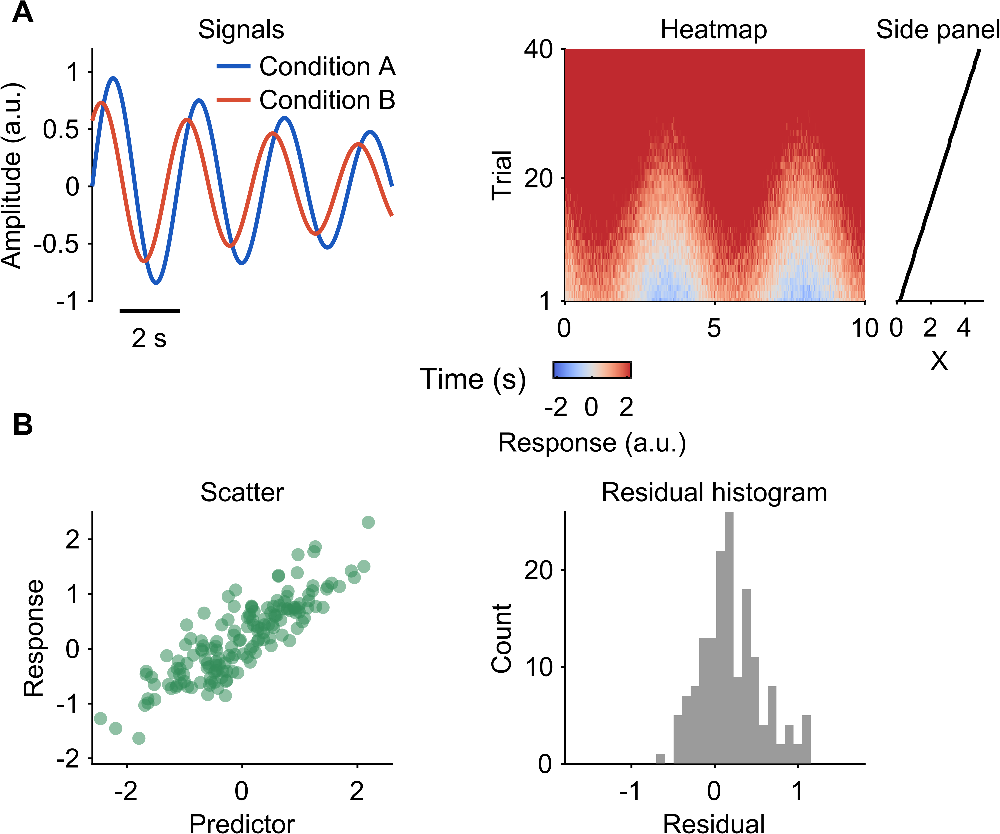

# EasyPlot: Shorter MATLAB code for publication-ready scientific figures

[](https://github.com/jiumao2/EasyPlot)
[](https://ww2.mathworks.cn/matlabcentral/fileexchange/156462-easyplot)
[](https://easyplot.readthedocs.io/en/latest/)

EasyPlot substantially shortens the amount of MATLAB code needed to make publication-ready scientific figures. It keeps native MATLAB plotting syntax familiar while making multi-panel layout, consistent styling, and figure export much faster.



## Use with Codex and Claude

This repo includes a local skill for writing publication-ready EasyPlot MATLAB code:
[`skills/EasyPlot-MATLAB`](./skills/EasyPlot-MATLAB).

For Codex:
- Invoke the skill as `$easyplot-matlab`.
- Example prompt: `Use $easyplot-matlab to write a 2x2 EasyPlot MATLAB figure script with explicit labels, no overlaps, and PNG/PDF export into Figure.`

For Claude:
- Point Claude directly to [`skills/EasyPlot-MATLAB/SKILL.md`](./skills/EasyPlot-MATLAB/SKILL.md) and ask it to follow that workflow.
- Example prompt: `Read and follow skills/EasyPlot-MATLAB/SKILL.md. Write a long linear EasyPlot MATLAB script for a publication-ready 2x2 figure with explicit scales, labels, and overlap-free layout.`

## Why EasyPlot for scientific figures

- Substantially shorten the code needed for publication-ready figures.
- Keep native MATLAB plotting calls (`plot`, `imagesc`, `scatter`, etc.).
- Build panel layouts using relative placement instead of manual position math.
- Apply labels, limits, and ticks across many axes with one command.
- Export clean, size-controlled figures for papers and presentations.

## 60-second quick start

1. Download this repository.
2. Add the `EasyPlot` folder to your MATLAB path.
3. Run the example below.

```matlab
fig = EasyPlot.figure();
ax = EasyPlot.axes(fig, 'Width', 6, 'Height', 4);

x = 0:0.01:2*pi;
plot(ax, x, sin(x), 'LineWidth', 1.5);

xlabel(ax, 'X');
ylabel(ax, 'sin(X)');
EasyPlot.cropFigure(fig);
EasyPlot.exportFigure(fig, 'quickstart.png');
```

## Learn Fast

- Publication workflow: [Write publication-ready figure scripts](https://easyplot.readthedocs.io/en/latest/tutorials/publication-workflow.html)
- Getting started: [Quick onboarding](https://easyplot.readthedocs.io/en/latest/getting_started.html)
- Tutorials: [Step-by-step workflows](https://easyplot.readthedocs.io/en/latest/tutorials/index.html)
- API overview: [Core functions](https://easyplot.readthedocs.io/en/latest/api/index.html)
- Example script: [`scripts/publication_workflow_example.m`](./scripts/publication_workflow_example.m)
- AI skill: [`skills/EasyPlot-MATLAB`](./skills/EasyPlot-MATLAB)

## Core capabilities

- Figure and axes creation with better defaults.
- Grid and relative layout helpers (`createGridAxes`, `createAxesAgainstAxes`, `align`, `place`).
- Batch axis controls (`setXLim`, `setYLim`, `setCLim`, shared labels and ticks).
- Figure finishing (`markAxes`, `scalebar`, `colorbar`, `cropFigure`, `exportFigure`).

## Citation and license

- License: [MIT](./LICENSE)
- If EasyPlot helps your publication workflow, please star the repository.

