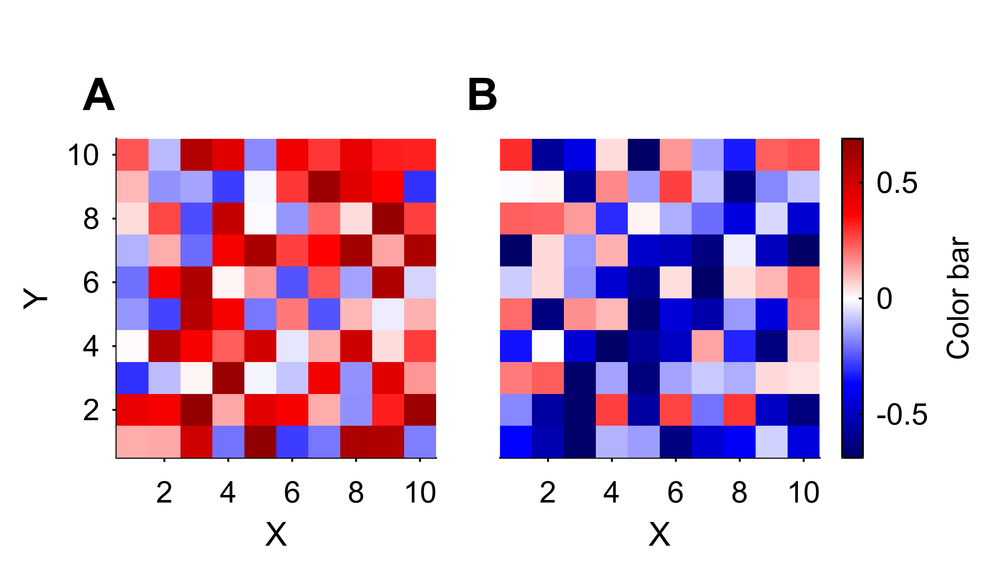

# EasyPlot: A MATLAB package for making scientific figures easily

[](https://github.com/jiumao2/EasyPlot)
[](https://ww2.mathworks.cn/matlabcentral/fileexchange/156462-easyplot)
[](https://matlab.mathworks.com/open/github/v1?repo=jiumao2/EasyPlot&file=demo.mlx)  
Save your time when making scientific figures with MATLAB

## Highlights  

- Similiar to the MATLAB grammar and support for all raw MATLAB functions
- Support for auto-completion and you do not need to remember the names of the functions and arguments
- Better default settings (e.g. NextPlot, Units, etc.)  
- Easier to layout multiple axes in a single figure
- Lots of useful functions frequently used in scientific figures

## Installation

- Download the repository and add the `EasyPlot` folder to your MATLAB path
- Use the codes simply by enter `EasyPlot.` and choose the function you want (using auto-completion)

## A simple example

[](https://matlab.mathworks.com/open/github/v1?repo=jiumao2/EasyPlot&file=demo.mlx)  

- A figure with 2 heatmaps  

```matlab
% create two 10x10 matrices
rng(1); % set the random seed
x1 = rand(10)-0.3; 
x2 = rand(10)-0.7;

% create a figure with two axes
fig = EasyPlot.figure(); % create a figure in EasyPlot style
ax1 = EasyPlot.axes(fig,... % create an axes in EasyPlot style
    'Height', 3,... % in centimeters
    'Width', 3,...
    'MarginBottom', 0.8);
% create the second axes on the right of the first axes
ax2 = EasyPlot.createAxesAgainstAxes(fig, ax1, 'right',...
    'YAxisVisible', 'off');

% plot the matrices the same way as in MATLAB
imagesc(ax1, x1);
imagesc(ax2, x2);

% set multiple xlabel and ylabel together
EasyPlot.setXLabelRow({ax1, ax2}, 'X');
EasyPlot.setYLabelRow({ax1, ax2}, 'Y');

% set the limits of the multiple axes together
EasyPlot.setXLim({ax1, ax2}, [0.5,10.5]);
EasyPlot.setYLim({ax1, ax2}, [0.5,10.5]);
% set the color limits that covers both axes
EasyPlot.setCLim({ax1, ax2}, 'largest');

% set the colormap and colorbar
% use the same colormap for both axes and set the white color for zero
EasyPlot.colormap({ax1, ax2}, EasyPlot.ColorMap.Diverging.seismic, 'zeroCenter', 'on');
EasyPlot.colorbar(ax2,...
    'label', 'Color bar',...
    'MarginRight', 1);

% mark the axes
EasyPlot.markAxes(fig, {ax1, ax2}, {'A','B'},...
    'xShift', 0.5,...
    'MarginTop', 0);

% export the figure
EasyPlot.cropFigure(fig);
EasyPlot.exportFigure(fig, 'test.png');
```



## Documentation

- See [here](./Documentation.md) to learn about how to use EasyPlot
