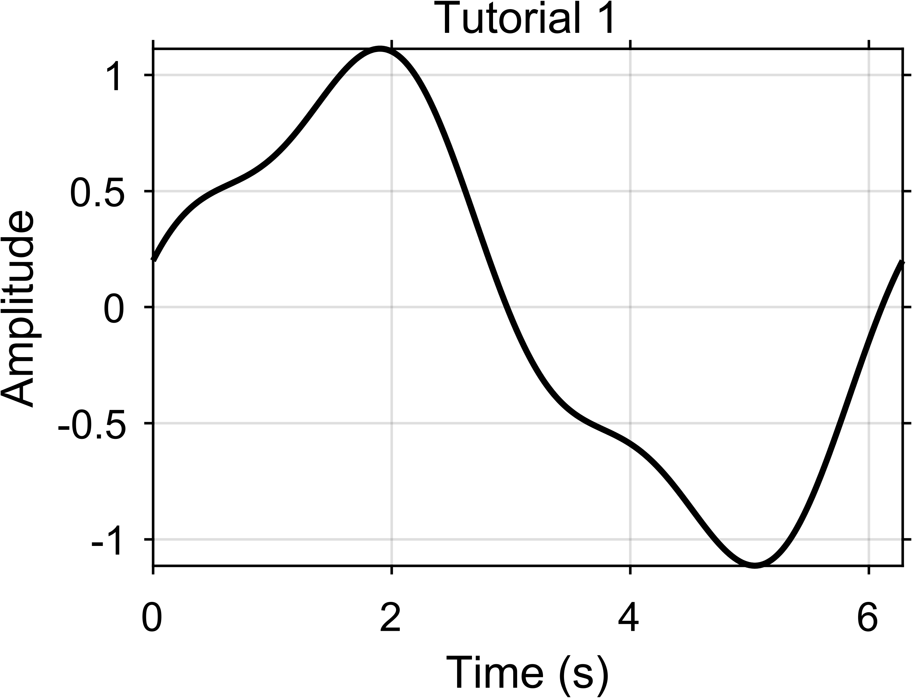

Tutorial 1: Figure, Axes, Set, Crop, Export
===========================================

Goal
----

Learn the core EasyPlot workflow:

1. create a figure and axes,
2. set properties during creation or later with ``EasyPlot.set``,
3. crop final canvas,
4. export publication-ready outputs.

Core functions
--------------

- ``EasyPlot.figure``
- ``EasyPlot.axes``
- ``EasyPlot.set``
- ``EasyPlot.cropFigure``
- ``EasyPlot.exportFigure``

Example
-------

.. code-block:: matlab

   fig = EasyPlot.figure('Visible', 'off', 'MarginLeft', 0.5, 'MarginBottom', 0.5);
   ax = EasyPlot.axes(fig, ...
       'Width', 5.2, 'Height', 3.6, ...
       'MarginLeft', 0.9, 'MarginBottom', 0.9, ...
       'FontSize', 8, 'Box', 'on');

   x = linspace(0, 2*pi, 300);
   y = sin(x) + 0.2*cos(3*x);
   plot(ax, x, y, 'k-', 'LineWidth', 1.2);

   EasyPlot.set(ax, 'XGrid', 'on', 'YGrid', 'on');
   xlabel(ax, 'Time (s)');
   ylabel(ax, 'Amplitude');
   title(ax, 'Tutorial 1');

   EasyPlot.cropFigure(fig);
   EasyPlot.exportFigure(fig, fullfile('./docs/tutorials/_images', 'tutorial1_basic.png'));

Expected output
---------------

Practical notes
---------------

- Prefer EasyPlot constructors over raw MATLAB ``figure``/``axes`` for consistent defaults.
- The plotting command is still the normal MATLAB command; only the axis handle is made explicit.
- Margins are part of the layout. They reserve room for labels and titles before you crop.
- Call ``EasyPlot.cropFigure`` near the end, after layout and annotations are done.
- Export after the figure already looks correct on screen.

Next step
---------

Continue with :doc:`multi-panel-layout`.
