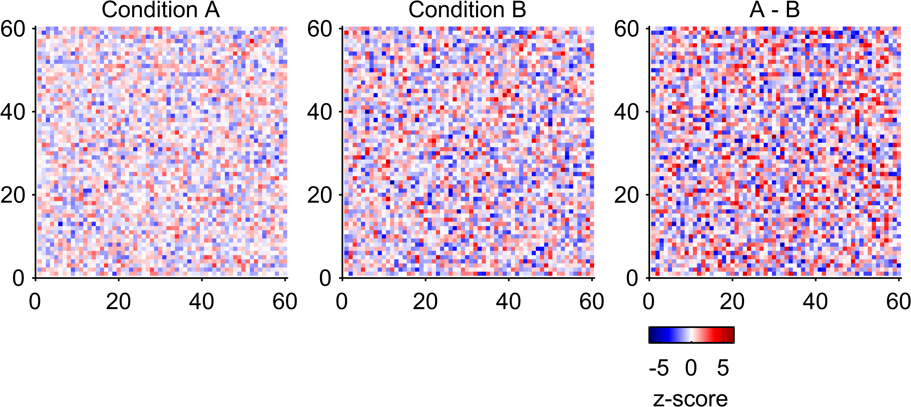

Tutorial 5: Heatmaps, CLim, Colormap, and Colorbar
==================================================

Goal
----

Build robust heatmap workflows with:

- shared ``CLim`` across axes,
- EasyPlot colormap package,
- white-centered diverging maps,
- customized EasyPlot colorbars.

Core functions
--------------

- ``EasyPlot.setCLim``
- ``EasyPlot.colormap``
- ``EasyPlot.colorbar``
- ``EasyPlot.ColorMap.*``

Example
-------

.. code-block:: matlab

   rng(10);
   fig = EasyPlot.figure('Visible', 'off');
   ax = EasyPlot.createGridAxes(fig, 1, 3, ...
       'Width', 2.7, 'Height', 2.7, ...
       'MarginBottom', 1.2, 'MarginTop', 0.5, ...
       'FontSize', 7);

   m1 = randn(60);
   m2 = randn(60) * 1.4;
   m3 = m1 - m2;

   imagesc(ax{1}, m1);
   imagesc(ax{2}, m2);
   imagesc(ax{3}, m3);

   title(ax{1}, 'Condition A', 'FontSize', 7);
   title(ax{2}, 'Condition B', 'FontSize', 7);
   title(ax{3}, 'A - B', 'FontSize', 7);

   EasyPlot.setCLim(ax, 'largest');
   EasyPlot.colormap(ax, EasyPlot.ColorMap.Diverging.seismic, ...
       'zeroCenter', 'on', 'zeroPosition', 0);

   EasyPlot.colorbar(ax{3}, ...
       'Location', 'southoutside', ...
       'Label', 'z-score', ...
       'Height', 0.16, ...
       'Width', 0.9, ...
       'MarginBottom', 0.95, ...
       'FontSize', 7);

   EasyPlot.cropFigure(fig);
   EasyPlot.exportFigure(fig, fullfile('./docs/tutorials/_images', 'tutorial5_colormap_colorbar.png'));

Expected output
---------------

Guidance
--------

- For multi-panel heatmaps, always set shared ``CLim`` before applying the same colormap.
- Use diverging colormaps with ``zeroCenter`` for signed effects.

Next step
---------

Continue with :doc:`tutorial-06-special-functions`.
