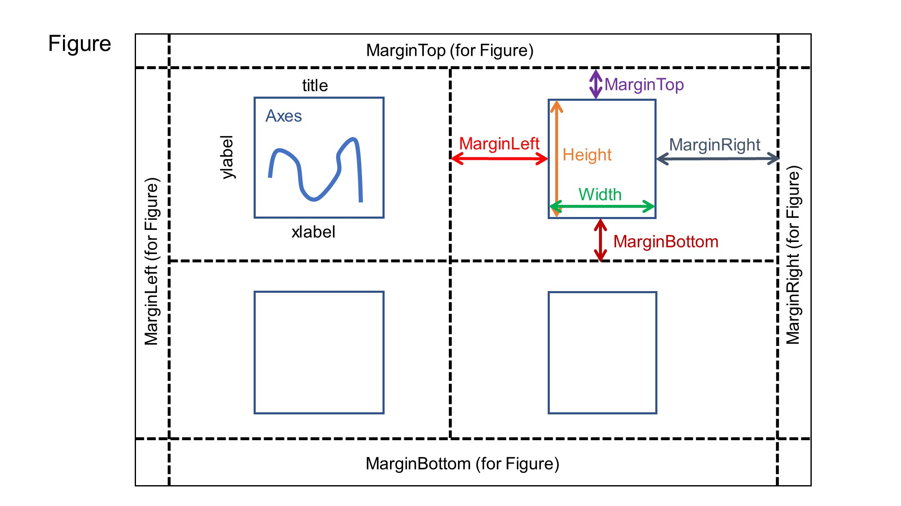
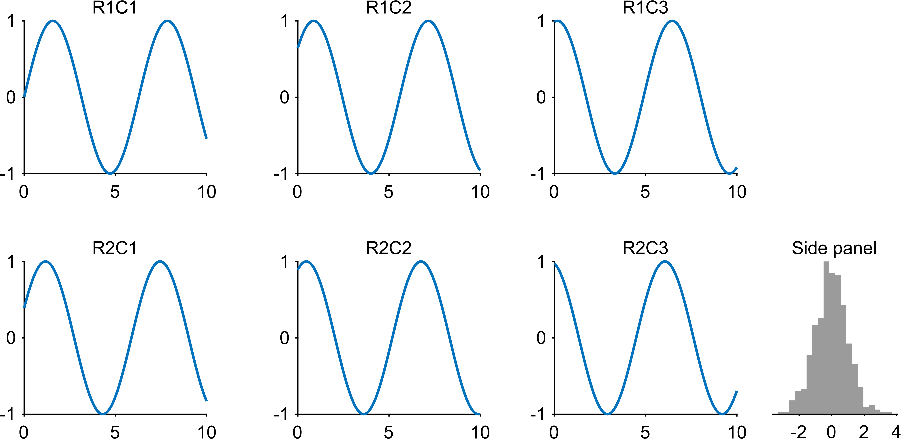

Tutorial 2: Multi-Panel Layout Principles
=========================================

Goal
----

Understand layout principles and panel composition with EasyPlot:

- margins and relative positioning,
- ``createGridAxes`` and ``createAxesAgainstAxes``,
- storing panels in 2D cell arrays,
- ``place`` / ``align`` / ``move``.

Core functions
--------------

- ``EasyPlot.createGridAxes``
- ``EasyPlot.createAxesAgainstAxes``
- ``EasyPlot.place``
- ``EasyPlot.align``
- ``EasyPlot.move``

Layout model
------------

The figure below is useful for understanding how EasyPlot thinks about layout.
The axes have their own ``Width`` and ``Height``, but they also reserve
``MarginLeft``, ``MarginRight``, ``MarginTop``, and ``MarginBottom``. The figure
itself has another set of margins. After ``EasyPlot.cropFigure(fig)``, the final
canvas size is determined by the axes sizes plus all reserved margins.

Read this diagram as:

- axes ``Width`` and ``Height`` define the plotting area itself,
- axes margins define the extra space that belongs to labels, ticks, and titles,
- figure margins define the outer whitespace of the entire composition,
- cropping at the end converts those layout decisions into the final figure size.

Example
-------

.. code-block:: matlab

   fig = EasyPlot.figure('Visible', 'off');

   ax_grid = EasyPlot.createGridAxes(fig, 2, 3, ...
       'Width', 2.5, 'Height', 2.1, ...
       'MarginLeft', 0.55, 'MarginRight', 0.45, ...
       'MarginTop', 0.45, 'MarginBottom', 0.75, ...
       'FontSize', 7);

   ax_side = EasyPlot.createAxesAgainstAxes(fig, ax_grid{1,3}, 'right', ...
       'Width', 1.7, 'Height', 2.1, 'YAxisVisible', 'off', 'FontSize', 7);

   for r = 1:2
       for c = 1:3
           ax = ax_grid{r,c};
           x = linspace(0, 10, 200);
           plot(ax, x, sin(x + 0.4*(r-1) + 0.7*(c-1)), 'LineWidth', 1);
           title(ax, sprintf('R%dC%d', r, c), 'FontSize', 7);
       end
   end

   histogram(ax_side, randn(450,1), 20, ...
       'FaceColor', [0.35,0.35,0.35], 'EdgeColor', 'none');
   title(ax_side, 'Side panel', 'FontSize', 7);

   EasyPlot.align(ax_side, ax_grid{2,3}, 'bottom');
   EasyPlot.place(ax_side, ax_grid{2,3}, 'right');
   EasyPlot.move(ax_grid(:,2:3), 'dx', 0.25);

   EasyPlot.cropFigure(fig);
   EasyPlot.exportFigure(fig, fullfile('./docs/tutorials/_images', 'tutorial2_layout.png'));

Expected output
---------------

Layout tips
-----------

- Think in relationships (right-of, bottom-of, aligned-to) instead of absolute coordinates.
- Keep panels in cell arrays so batch operations stay simple and robust.
- Use margins to reserve space for labels and titles before you start moving panels around.
- Crop only at the end, after the layout is stable.

Next step
---------

Continue with :doc:`tutorial-03-multi-axes-wrappers`.
