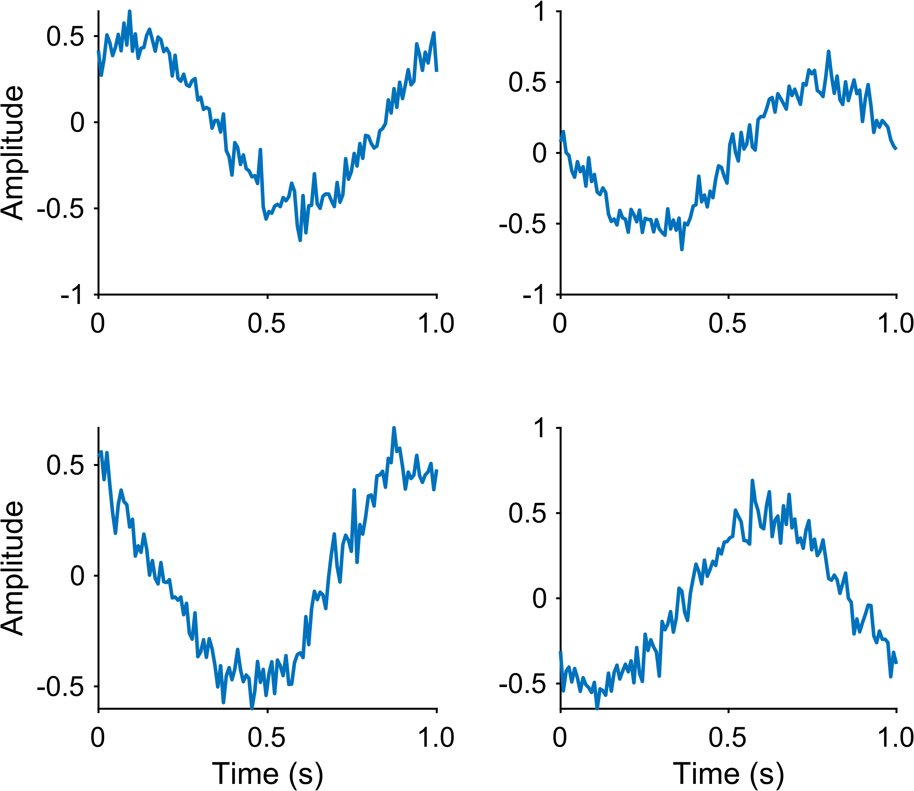

Tutorial 3: Multi-Axes Wrappers for Labels, Ticks, and Titles
==============================================================

Goal
----

Use EasyPlot wrappers that extend MATLAB-style axis functions to multiple axes
(including 2D cell arrays) at once.

Core functions
--------------

- ``EasyPlot.setXLabelRow`` / ``EasyPlot.setYLabelColumn``
- ``EasyPlot.setXTicksAndLabels`` / ``EasyPlot.setYTicksAndLabels``

Example
-------

.. code-block:: matlab

   fig = EasyPlot.figure('Visible', 'off');
   ax_all = EasyPlot.createGridAxes(fig, 2, 2, ...
       'Width', 3.0, 'Height', 2.5, ...
       'MarginBottom', 0.9, 'MarginLeft', 0.8, ...
       'FontSize', 7);

   x = linspace(0, 1, 120);
   for k = 1:numel(ax_all)
       ax = ax_all{k};
       plot(ax, x, randn(1, numel(x))*0.08 + 0.5*sin(2*pi*x + k), ...
           'LineWidth', 0.9);
   end

   EasyPlot.setXLabelRow(ax_all(2,:), 'Time (s)');
   EasyPlot.setYLabelColumn(ax_all(:,1), 'Amplitude');

   xt = [0, 0.5, 1.0];
   EasyPlot.setXTicksAndLabels(ax_all, xt, {'0', '0.5', '1.0'});

   EasyPlot.cropFigure(fig);
   EasyPlot.exportFigure(fig, fullfile('./docs/tutorials/_images', 'tutorial3_multi_axes_wrappers.png'));

Expected output
---------------

Notes
-----

- These wrappers reduce repetitive code in large multi-panel figures.
- You can still mix in raw MATLAB calls when needed.

Next step
---------

Continue with :doc:`tutorial-04-shared-limits`.
