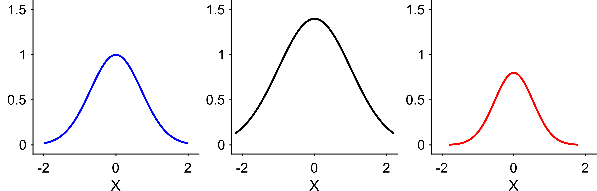

Tutorial 4: Shared Limits (xlim/ylim/clim)
==========================================

Goal
----

Set limits consistently across panels, either with explicit ranges or by using
EasyPlot's ``'largest'`` mode.

Core functions
--------------

- ``EasyPlot.setXLim``
- ``EasyPlot.setYLim``
- ``EasyPlot.setCLim``

Example
-------

.. code-block:: matlab

   fig = EasyPlot.figure('Visible', 'off');
   ax_all = EasyPlot.createGridAxes(fig, 1, 3, ...
       'Width', 3.0, 'Height', 2.8, ...
       'MarginBottom', 0.9, 'FontSize', 7);

   x = linspace(-2, 2, 200);
   y1 = exp(-x.^2);
   y2 = 1.4*exp(-0.6*x.^2);
   y3 = 0.8*exp(-1.4*x.^2);

   plot(ax_all{1}, x, y1, 'b-', 'LineWidth', 1);
   plot(ax_all{2}, x*1.1, y2, 'k-', 'LineWidth', 1);
   plot(ax_all{3}, x*0.9, y3, 'r-', 'LineWidth', 1);

   EasyPlot.setXLim(ax_all, [-2.3, 2.3]);
   EasyPlot.setYLim(ax_all, [-0.1, 1.6]);
   EasyPlot.setXLabelRow(ax_all, 'X');
   EasyPlot.setYLabelRow(ax_all, 'Y');

   EasyPlot.cropFigure(fig);
   EasyPlot.exportFigure(fig, fullfile('./docs/tutorials/_images', 'tutorial4_shared_limits.png'));

Expected output
---------------

Guidance
--------

- Use explicit limits when you need strict comparability.
- Use ``'largest'`` for quick harmonization across exploratory panels.

Next step
---------

Continue with :doc:`labels-colorbar-export`.
