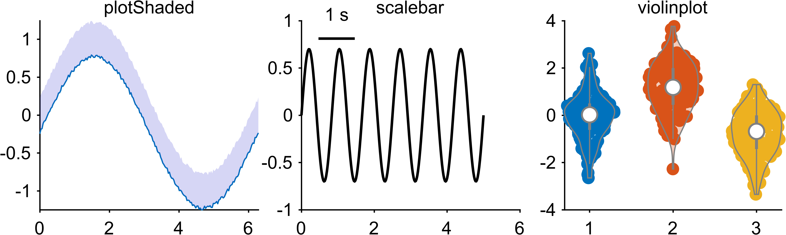

Tutorial 6: Special Plotting Functions
======================================

Goal
----

Use high-value EasyPlot plotting utilities beyond raw MATLAB defaults:

- ``EasyPlot.plotShaded``
- ``EasyPlot.scalebar``
- ``EasyPlot.violinplot``

(also explore ``EasyPlot.boundedLine``, ``EasyPlot.significanceLine``, ``EasyPlot.venn``)

Example
-------

.. code-block:: matlab

   rng(6);
   fig = EasyPlot.figure('Visible', 'off');
   ax = EasyPlot.createGridAxes(fig, 1, 3, ...
       'Width', 3.0, 'Height', 2.6, ...
       'MarginBottom', 0.9, ...
       'FontSize', 7);

   % (1) plotShaded
   x = linspace(0, 2*pi, 200);
   y = sin(x);
   y_low = y - 0.2 - 0.05*rand(size(y));
   y_high = y + 0.2 + 0.05*rand(size(y));
   EasyPlot.plotShaded(ax{1}, x, [y_low; y_high], ...
       'shadedColor', [0.2,0.2,0.8], 'alpha', 0.2, 'drawLine', 'on');
   title(ax{1}, 'plotShaded', 'FontSize', 7);

   % (2) scalebar
   t = 0:0.02:5;
   s = 0.7*sin(2*pi*1.2*t);
   plot(ax{2}, t, s, 'k-', 'LineWidth', 1.0);
   h_sb = EasyPlot.scalebar(ax{2}, 'X', ...
       'location', 'northwest', ...
       'xBarLabel', '1 s', ...
       'xBarLength', 1, ...
       'xBarRatio', 1, ...
       'fontSize', 7);
   EasyPlot.move(h_sb, 'dx', 0.08, 'dy', -0.10);
   title(ax{2}, 'scalebar', 'FontSize', 7);

   % (3) violinplot
   d = [randn(120,1); randn(120,1)+1.2; randn(120,1)-0.8];
   g = [ones(120,1); 2*ones(120,1); 3*ones(120,1)];
   EasyPlot.violinplot(ax{3}, d, g);
   title(ax{3}, 'violinplot', 'FontSize', 7);

   EasyPlot.cropFigure(fig);
   EasyPlot.exportFigure(fig, fullfile('./docs/tutorials/_images', 'tutorial6_special_functions.png'));

Expected output
---------------

More special methods
--------------------

- ``EasyPlot.boundedLine`` for mean +/- error ribbons.
- ``EasyPlot.significanceLine`` for compact significance annotations.
- ``EasyPlot.venn`` for 2-set/3-set overlap visualization.

Completion
----------

You now have the recommended EasyPlot learning path from foundation to advanced plotting.
